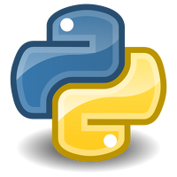
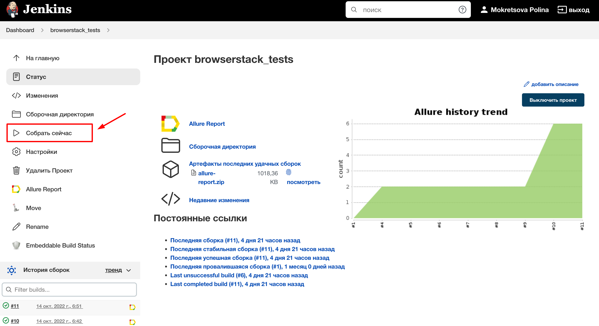
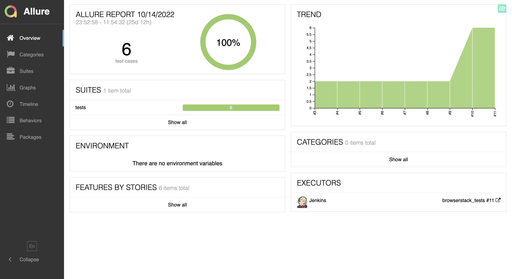
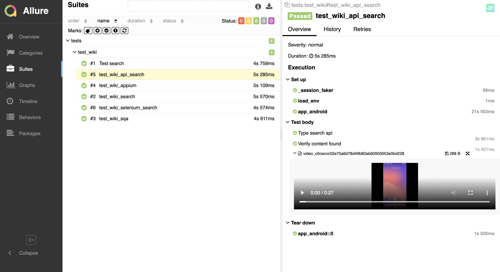
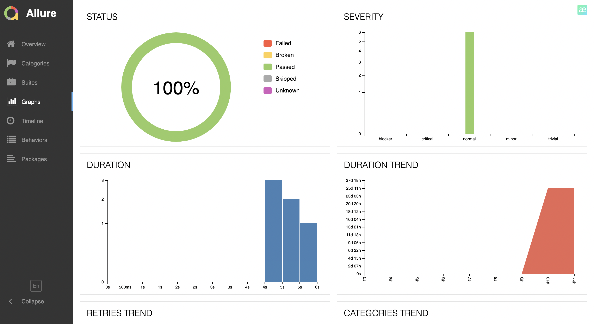
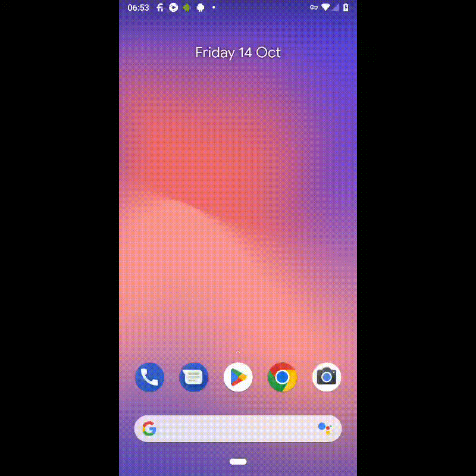
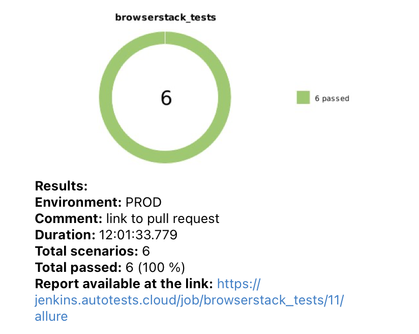
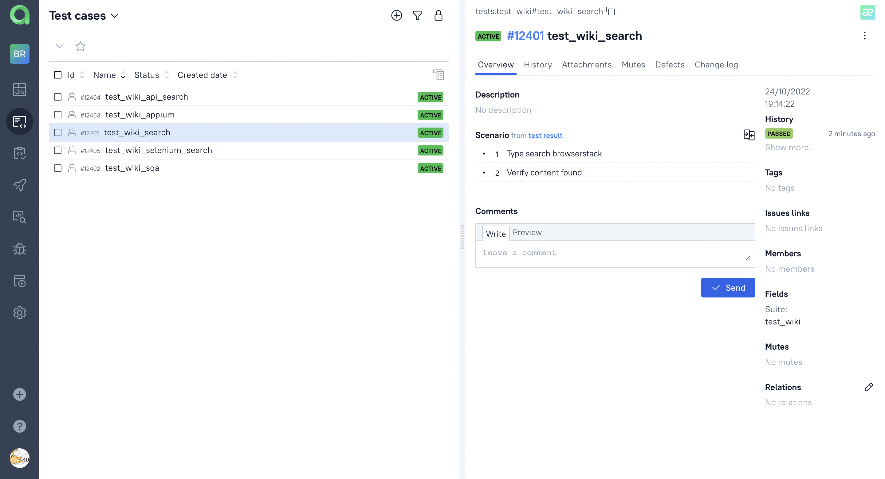
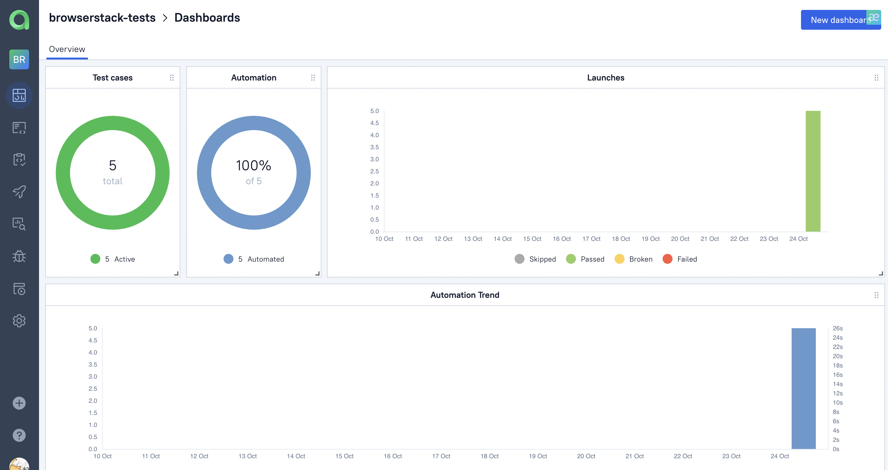

# Проект автотестов на мобильное приложение [Wikipedia](https://www.wikipedia.org/)
Проект mobile автотестов мобильного приложения Wikipedia

# Оглавление
1. [Технологии](#технологии)
2. [Описание проекта](#описание)
3. [Запуск тестов в jenkins](#запуск_дженкинс)
4. [Результат прохождения тестов в Allure report](#report)
5. [Результаты работы тестов](#видео)
    1. [Пример работы тестов (видео)](#видео)
    2. [Результаты тестов в телеграм](#телеграм)
6. [Allure TestOps](#проект)
    1. [Проект](#проект)
    2. [Dashboard](#дашборд)

 
# Использованы слудующие технологии:

[К оглавлению ⬆](#оглавление)
 
# Описание проекта
Автоматизирована проверка поиска в мобильном приложении Wikipedia через Browserstack

[К оглавлению ⬆](#оглавление)

# Запуск тестов в [Jenkins](https://jenkins.autotests.cloud/job/browserstack_tests/) выглядит следующим образом
Главная страница сборки

[К оглавлению ⬆](#оглавление)

# [Отчет](https://jenkins.autotests.cloud/job/browserstack_tests/allure/) о выполнении тестов

Каждый тест, независимо от результата, состоит из:
- начальных параметров,
- шагов, 
- видео выполнения теста.

Окно с графиками

[К оглавлению ⬆](#оглавление)

# Пример прохождения теста на удаленной машине

[К оглавлению ⬆](#оглавление)

# По результатам работы тестов отправляется краткий отчет в Telegram

[К оглавлению ⬆](#оглавление)
 
# Создан проект в Allure TestOps

[К оглавлению ⬆](#оглавление)

 
# Настроен Dashboard с разными показателями

[К оглавлению ⬆](#оглавление)
